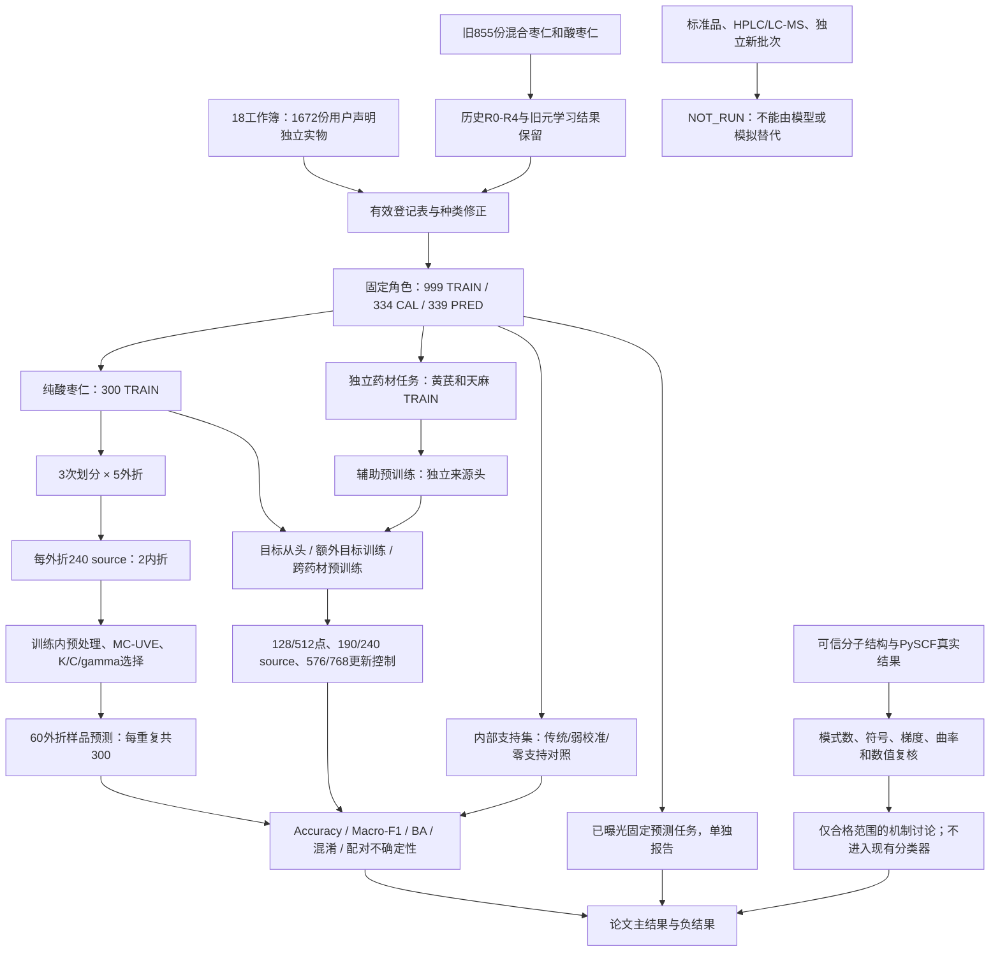

# 实验脉络与论文证据流程

本图描述已实施的数据边界及研究分支；量子与实验室项目的资格由专项报告决定。

```mermaid
flowchart TD
    A[18工作簿：1672份用户声明独立实物] --> B[有效登记表与种类修正]
    H[旧855份混合枣仁和酸枣仁] --> H1[历史R0-R4与旧元学习结果保留]
    H1 --> B
    B --> C[固定角色：999 TRAIN / 334 CAL / 339 PRED]
    C --> D[纯酸枣仁：300 TRAIN]
    D --> E[3次划分 × 5外折]
    E --> F[每外折240 source：2内折]
    F --> G[训练内预处理、MC-UVE、K/C/gamma选择]
    G --> I[60外折样品预测：每重复共300]
    I --> J[Accuracy / Macro-F1 / BA / 混淆 / 配对不确定性]
    C --> K[独立药材任务：黄芪和天麻 TRAIN]
    K --> L[辅助预训练：独立来源头]
    D --> M[目标从头 / 额外目标训练 / 跨药材预训练]
    L --> M
    M --> N[128/512点、190/240 source、576/768更新控制]
    N --> J
    C --> O[已曝光固定预测任务，单独报告]
    C --> P[内部支持集：传统/弱校准/零支持对照]
    P --> J
    Q[可信分子结构与PySCF真实结果] --> R[模式数、符号、梯度、曲率和数值复核]
    R --> S[仅合格范围的机制讨论；不进入现有分类器]
    T[标准品、HPLC/LC-MS、独立新批次] --> U[NOT_RUN：不能由模型或模拟替代]
    J --> V[论文主结果与负结果]
    O --> V
    S --> V
```

另一主机B的来源域二分类是单独支线，不能替代图中纯酸五来源任务；其校准改善也不能直接转移。
当前所有模型比较均受既有样品曝光、来源与批次混杂的限制。
